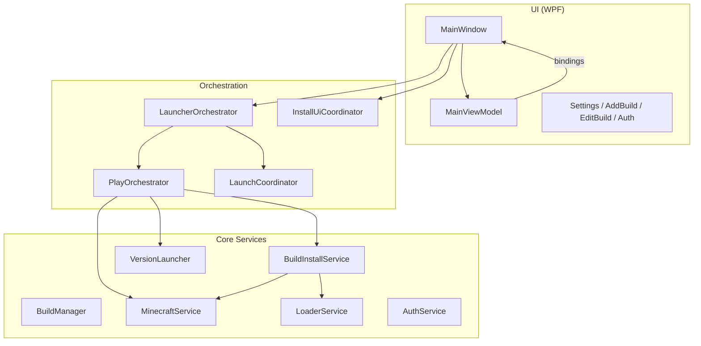

# Apeiron Launcher — Architecture

Portable Minecraft launcher for Windows (.NET 8 / WPF).

## Layers



## Install flow

1. User clicks **Play** → `LauncherOrchestrator.ValidateBuild`
2. Java ensured via `JavaService`
3. If not installed → `PlayOrchestrator.InstallIfNeededAsync`
   - `MinecraftService.DownloadVanillaMinecraft` (manifest cache + HTTP retry)
   - `LoaderService.InstallLoader` (Fabric / Quilt / Forge / NeoForge)
   - Optional `FabricApiService`
4. `LaunchCoordinator.ResolveLaunchIdentityAsync` (Microsoft or offline)
5. `PlayOrchestrator.LaunchGameAsync` → `VersionLauncher` spawns JVM process

## Data on disk

```
Apeiron.exe
├── .minecraft/       # Shared game assets (versions, libraries)
├── instances/<id>/   # Per-instance saves, mods, config
├── config/
│   ├── settings.json
│   ├── builds.json
│   └── auth.json     # DPAPI-encrypted
└── logs/
```

## Key extension points

| Area | Entry point |
|------|-------------|
| UI state | `MainViewModel` — status, play button, download progress bindings |
| New mod loader | `LoaderService.InstallLoader` switch |
| CLI | `LaunchArgsParser` → `MainWindow` quick launch |
| Modpack import | `ModpackImportService` / drag-drop on `MainWindow` |
| Auto-update | `LauncherUpdateService` + GitHub Releases |

## Tests

Unit tests live in `Apeiron.Tests/` (178+). Run:

```bash
dotnet test Apeiron.Tests/Apeiron.Tests.csproj -c Release
```

Manual checklist: [TESTING.md](TESTING.md)
